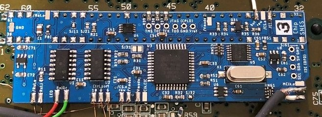
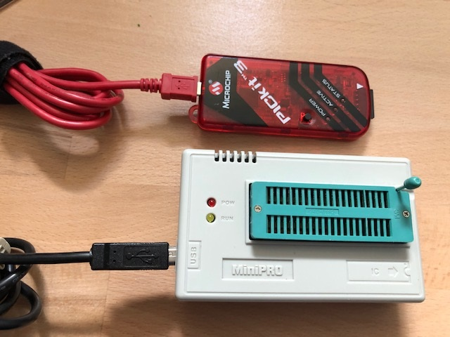
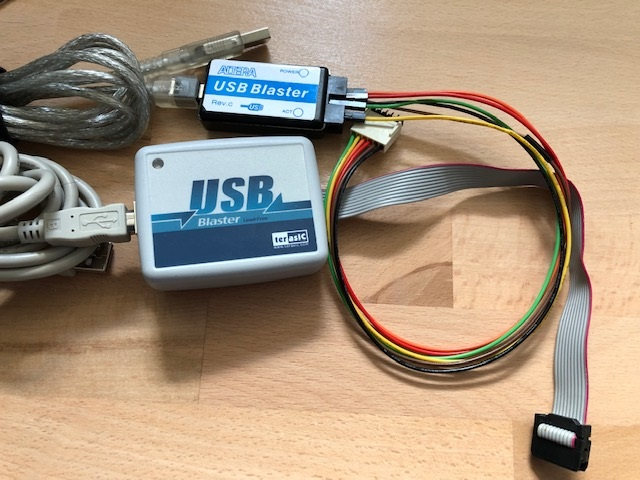
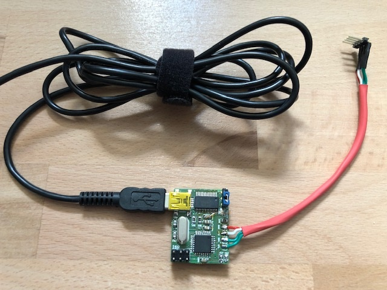

## Multi-Region Mod for any SNES

**Free your SNES**

(picture shows last prototype PCB installed on a SNS-CPU-RGB-01)

### Acknowledgement and Licensing

This PCB, its idea and design, is a confluence of multiple projects. All credits and rights are going to their respective creators:

- **SuperCIC-lock** by Ikari_01
  Copyright (c) 2010 by Maximilian Rehkopf under GNU GPLv2
  Source: [sd2snes homepage](https://sd2snes.de/blog/cool-stuff/supercic)
- **uIGR** by Ikari_01 and borti4938
  Copyright (c) 2010 by Maximilian Rehkopf under GNU GPLv2,
  and modifications copyright (c) 2015 by Peter Bartmann under GNU GPLv2
  Source: [sd2snes homepage](https://sd2snes.de/blog/cool-stuff/in-game-reset), [this repository](./fw/uIGR)
- **Region Patch** built in SNES by Ikari_01 (initial idea and detection using SuperCIC-lock) and borti4938 (schematic refinement and CPLD implementation)
  Initial idea (c) 2012 ikari_01, CPLD implementation as used here covered in DeJitter license
  Source: [sd2snes homepage](https://sd2snes.de/files/supercic-213f.pdf)
- **DeJitter** by marqs85
  Copyright (c) 2017-2018 Markus Hiienkari under MIT
  and modifications and additions copyright (c) 2019 Peter Bartmann under MIT
  Source: [Original GitHub Repository](https://github.com/marqs85/snes_dejitter), [this repository](./fw/Logic)
- **DFO** by micro
  Copyright / created 2015 by Jakob Schäfer without licensing (but given to retro community)
  Source: mirror in [this repository](./fw/dfo), with minor adaptations and with several original sources noted [in the Source.md file](./fw/dfo/SOURCE.md)
- **PCB design** by borti4938
  Copyright (c) 2019 by Peter Bartmann under GNU GPLv3

### Features

- **SuperCIC:** lockout chip replacement 50Hz/60Hz switch cabability
- **uIGR:** controller input sniffing to perform certain actions like reset or 60Hz and 50Hz switch up on certain combinations
- **Region Patch:** overrides region protection based on picture processing status reads
- **DeJitter:** removes jitter on sync for NTSC mode
- **DFO:** dual frequency oscillator, here used to switch between base clocks for 50Hz, 60Hz video-modes

### PCB Description

#### Solder Pads

These are just general descriptions of the in- and outputs. Please refer to the installation instructions for each [specific mainboard version](./installation/) (if exists) for suitable connections.

- **/Rst.o:** (output (2x))
  Low-active reset output. This has to be connected with CIC-lock pad 10 / S-APU pin 100. Connect either pad.
- **Rst.i:** (input)
  High-active reset input. This pad has to be connected with the CIC-lock pad 8 (reset button).
- **LED.Re:** (output)
  LED driver for replacement LED; usually red. Output is active on 60Hz and auto video mode and off on 50Hz (or vice versa if SJ21 is set (common anode LED))
- **LED.Gr:** (output)
  LED driver for replacement LED; usually green. Output is active on 50Hz and auto video mode and off on 60Hz (or vice versa if SJ21 is set (common anode LED))
- **Ctrl.port.10:** (input)
  Input for controller 1 sniffing (data latch signal). _Port_ refers to flat cable connector of the whole controller panel, i.e. pin is equivalent for controller connector pin 3.
- **Ctrl.port.8:** (input)
  Input for controller 1 sniffing (data clock signal). _Port_ refers to flat cable connector of the whole controller panel, i.e. pin is equivalent for controller connector pin 2.
- **Ctrl.port.6:** (input)
  Input for controller 1 sniffing (serial data signal). _Port_ refers to flat cable connector of the whole controller panel, i.e. pin is equivalent for controller connector pin 4.
- **Vmode:** (output)
  Output sets the PPU video mode at S-PPU1 pin 24 and S-PPU2 pin 30 or at the S-CPUN pin 111. Output is active on 50Hz mode and inactive on 60Hz mode.
- **/Vmode:** (output (2x))
  Output sets the video encoding at the video encoder, which is pin 19 of the S-ENC and pin 9 of the S-RGB. Connect just on of the pads!
- **Clk.CIC:** (input)
  Input for the SuperCIC-lock clock, which comes from CIC pad 7.
- **MClk.o:** (output)
  Output for the (de-jittered) master clock of the SNES. This is approx. 21.477MHz in NTSC mode and appr. 17.734MHz (1Chip-SNES, SJ32 not set) or appr. 21.281MHz (non-1Chip, SJ32 set) in PAL mode. Please refer to the general installation note to see whether and how to connect this pad properly.
- **CClk.o:** (output)
  Output of the color carrier, which is appr. 3.380MHz in NTSC mode and appr. 4.433MHz in PAL mode. Please refer to the general installation note to see whether and how to connect this pad properly.
- **/CS.i:** (input (2x since SMR20190813)
  Input of the 'original' (non-de-jittered) composite sync. This comes from pin 100 S-PPU2 or pin 151 S-CPUN.
- **/CS.o buf:** (output)
  Buffered (de-jittered) composite sync output. This is meant to be connected directly to the multiout pin 3. Note: The PAL SNES has 12V connected to this pin, which has to be removed.
- **/CS.o raw:** (output (2x))
  Raw output of the CPLD, which has 3.3V high and 0V low level. Connect it to the video encode, which is pin 8 of the S-ENC or pin 7 of the S-RGB (both chips allows 2.0V for input high, so 3.3V high is sufficient.)

#### Jumper

- **SJ11:** alternative clock for the SuperCIC; close this jumper if you don't connect the _Clk.CIC_ pad in order to use the clock meant for the CIC-key
- **SJ21:** close this jumper if you use a LED with a common anode. Otherwise leave this jumper untouched
- **SJ31:** closing this jumper permanently disables the de-jitter function. This solder jumper is a bit larger to give the installer the option to connect a slide switch here (_speed-runner discussions_)
- **SJ32:** short this jumper if the board is installed in a non-1Chip-SNES (SNES Jr. / SNES2 are also 1Chip-SNES)
- **SJ61:** distributes clock output to cartridge slot pin 1. This jumper **must not** be closed in 1Chip-SNES. Side note: if SJ32 is open, SJ61 has to open, too.
- **SJ63:** (since SMR20200323) decides which color carrier is forwarded to output. This jumper has two option; you must not close both jumpers!
  - SJ63.1: (marked with a dot) outputs color carrier derived from non-dejittered clock.  
    Use this if you have a problem with discoloring on composite sync or S-Video ([issue thread at shmups](https://shmups.system11.org/viewtopic.php?p=1389666#p1389666))  
    Btw: this is default for all earlier version of the modding board flashed with the current firmware. If you need the other color carrier, just go back to a previous version.
  - SJ63.2: outputs color carrier derived from dejittered clock.  
    (I personally need to use this clock as my TV does not like the color carrier from non-dejittered clock)
  - Again: **You must not close both jumpers!**
- **SJ93**: (since SMR20200323) controls sync level of buffered csync output. Sync level:
  - opened: appr. 1.87V @ 75ohm termination i.e. needs a resistor inside the sync wire further attanuating the signal. Designed to work for cables with 470 ohm resistor inside resulting in appr. 450mV @ 75ohm termination
  - closed: appr. 300mV @ 75ohm termination suitable for pass through wired cables at sync, works with standard TV / scaler setup

#### Firmware

U1, U2, U3 and U5 need a firmware flashed to the chip. U1 and U2 have to be programmed prior to assembly whereas the PCB provides ICSP headers for the other ones.

- **U1:** PIC 16F630 microcontroller with - [SuperCIC-lock firmware](http://sd2snes.de/files/supercic.zip)
- **U2:** PIC 16F684 microcontroller with [uIGR firmware](https://raw.githubusercontent.com/borti4938/SNES_MultiRegion_with_DeJitter_QID/tree/master/fw/uIGR/snes_uigr_684_with_lock.hex)

Use a PICKit, TL866CS or similar programmer.

- **U3:** EPM7032 CPLD with clock switch, region patch and de-jitter firmware. You have to choose the right one depending on your modding board version.

  - [Version SMR20190813 (and later)](https://github.com/borti4938/SNES_MultiRegion_with_DeJitter_QID/tree/master/fw/Logic/output_files/multi_func/multi_function.pof?raw=true)
  - [Version SMR20190603 and earlier](https://github.com/borti4938/SNES_MultiRegion_with_DeJitter_QID/tree/master/fw/Logic/output_files/multi_func_legacy/multi_func_legacy.pof?raw=true)

Use an Altera USB Blaster (or clone) for flashing the firmware.

After assembly, the modding board has to be powered for flashing the firmware. This can be done by using the DFO programmer connected with V_target set to 5V (or 3.3V) if the modding board is not installed yet (other power solutions are possible, but please use the 5V power supply rail to not harm the DC converters. Or you can simply switch on the SNES for programming. Of course, the CPLD can be also flashed prior to assembly if you have a proper adapter at hand.

- **U5:** CDCE913 with [appropriate configuration](https://github.com/borti4938/SNES_MultiRegion_with_DeJitter_QID/tree/master/fw/dfo/clockpro/snes_multi_region.hex?raw=true)

Use the DFO programmer to flash the PLL. The [DFO readme](./fw/dfo/SOURCE.md) describes how to properly perform the flashing.

### Installation Notes

#### Manufacturing the PCB

You can choose any manufacturer which you prefer. All files for manufacturing including the design files are provided in subfolder [gerber/pcb/](./gerber/pcb/). As the PCB is designed in EAGLE (current version 7.4.2), gerbers are exported in the actual format. However, some services have problem while automatically analyze those like OSHPark or JCLPCB. Please try the older format in [gerber/pcb.eagle_legacy_export/](./gerber/pcb.eagle_legacy_export/).

For using the OSHPark service, you can also look for my [uploaded project](https://oshpark.com/profiles/borti4938). (check version)

**IMPORTANT**
Please use a substrate thickness of 0.8mm in order to make installation easier.

#### Assembly

##### Sourcing the Parts

For sourcing the parts, please be referred to the [Bill Of Materials](https://github.com/borti4938/SNES_MultiRegion_with_DeJitter_QID/tree/master/pcb/BOM.xlsx?raw=true)

##### Soldering

The PCB is designed with having hand soldering in mind. Most complicated footprints are probably the 44TQFP package of the CPLD or the 14TSSOP of the CDCE913.

However, if you plan to use a stencil, you can use the [stencil gerber file](./gerber/stencil/SNES_MR_DeJitter_QID.GTP). All SMDs are placed in top layer.

**IMPORTANT**
SuperCIC (PIC16F630-I/SL) and uIGR (PIC16F684-I/SL) need firmware flashed prior to soldering as mentioned later in this document.

#### Installation

This is not a complete installation manual. It's moreover a general overview on _'HowTo'_. Installation manuals are provided in the [subfolder installation](./installation/) once ready. I cannot test every single mainboard revision (there are too many out there), so the installation folder will grow from time to time once I see a proper report of an installation or I did an installation on a specific mainboard version on my own.

##### Preparation of SNES

###### General Steps

- remove original CIC-lock (or at least lift pins 1, 2, 10 and 11)
- remove LED from front panel (large SNES only)

###### Specific Steps for 1Chip-SNES

- lift pin 111 from S-CPUN
- remove X1
- lift pin 9 from S-RGB (or cut encoding mode jumper at bottom side of SNES mainboard (NTSC board revisions))

###### Specific Steps for Non-1Chip-SNES

- lift pin 24 of S-PPU1 and pin 30 of S-PPU2
- disconnect Master-Clock
  - SNSP-CPU-01/02: lift pin 4 of the S-CLK or remove R73 (0ohm jumper)
  - different methods for NTSC mainboards
- lift CSYNC input pin of the video encoder
  - pin 8 of S-ENC
  - pin 7 of S-RGB
- if you want to switch color carrier:
  - PAL: lift pin 5 of the S-CLK
  - NTSC: lift pin 3 of the S-PPU2
  - SNES with S-ENC: lift pin 19 (or cut encoding mode jumper at bottom side of SNES mainboard (NTSC board revisions))
  - SNES with S-RGB: lift pin 9 (or cut encoding mode jumper at bottom side of SNES mainboard (NTSC board revisions)) 

##### Installation of PCB

###### General Steps

- Solder PCB in place under the cartridge slot. Be aware of the orientation (pin marking must match)
- put the replacement dual LED where the original was (use a small piece of hot glue if needed)...  
... or in SNES2 / Jr. think of a good place where the replacement LED can be if you want to use it...  
... and connect the common pole to either _Ground_ or _Vcc_ (common cathod or anode, respectively)
- connect pads _Rst.o, Rst.i, LED.Re, LED.Gr, Ctrl.port.10-6, Vmode, /CS.i, /CS.o (raw)_ according to their description
- either connect _Clk.CIC_ pad (preferable) or close jumper _SJ11_
- close jumper _SJ21_ if you use a LED with common anode

###### Specific Step for 1Chip-SNES

- connect _MCLK.o_ to X1 (the side which is connected to S-CPUN pin 9)
- connect _/Vmode_ to S-RGB pin 9
- (color carrier is switched by S-CPUN so there is no need to connect _CClk.o_)

###### Specific Step for Non-1Chip-SNES 

- close _SJ32_ and _SJ61_
- if you plan to switch color carrier:
  - connect _CClk.o_ to either pad 3 of S-PPU2 (NTSC) or to pad 5 of S-CLK (PAL)
  - connect _/Vmode_ to S-ENC pin 19 / S-RGB pin 9 

### Using a Modded SNES with Flashcards

In general, using flashcards like the sd2snes, SuperEverdrive and PowerPak together with the **region patching** activated is not a good idea. I try to explain why!

First of all, one has to understand how a region patch works. In the S-PPU2 register $213F bit 4 shows whether the SNES is running in NTSC-mode or in PAL-mode (set up using S-PPU2 pin 30 or S-CPUN pin 111). Many games are checking this register on start-up (or during the gameplay) and check the value on bit 4. NTSC-games expect a '0' whereas PAL-games a '1'. If the bit does not return the required value, the game ends with _'This gamepak is not designed for your SFC/SNES'_ or similar.
A region patch observes the address bus B and recognizes a request of $213F. Then the patch forces on the data bus bit 4 GND or Vcc by simply 'beating'/'overdriving' the output of the S-PPU2.

An important point is how the region patch 'knows' which value has to be written.
On this modding PCB the SuperCIC-lock outputs the value on pin 3. The bit is determined using the CIC-key found on the cartridge. And this is the point where flash-cards become 'critical' for the region patch. As the SuperCIC-lock only checks the region of the cartridge using the CIC-key, the SuperCIC-lock CANNOT know which region the loaded ROM is. The overwritten value on bit 4 during a $213F request might be incorrect!
As flashcards have there own region patching (at least the sd2snes; I don't own a SuperEverdrive or PowerPak) you can simply switch off the region patch of the modding PCB (using Sel+L+R+Dw; LED-code: red-off-red).

#### A very last remark to the sd2snes:
As the SuperCIC-lock is part of the sd2snes project, there is another solution: the so-called 'Pairmode'.
The pairmode is available with the firmware v0.1.7 preview 4 or later. In the Pairmode the SuperCIC-lock goes into a pairmode-loop with the sd2snes. In this loop, forced region, LED status and the ROM region is constantly updated.

To change the forced region (and thus the LED-state) using the sd2snes (via the config.yml or the option GUI -> SuperCIC Settings), the uIGR has to be in the SuperCIC-mode (using Sel+L+R+Le / Sel+L+R+Ri) as the uIGR is master and the SuperCIC-lock slave regarding the region set to the SNES.
As the ROM region is updated constantly, the region patch on the modding PCB can be left on. I recommend to switch the sd2snes-own region patch off in this case (via the config.yml or the option GUI -> In-game Settings).