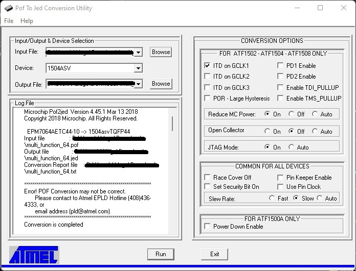

Use this firmware for SNES [Multi Region Boards](https://github.com/borti4938/SNES-AddOn-PCBs/tree/master/MultiRegion_with_DeJitter_QID) of version V20190813 (and later).

These firmware files are for the Atmel CPLD equivalents and introduced in this repository as the Altera CPLDs became obsolete.

Conversion of the Altera firmware build to the Atmel ATF1502ASV or ATF1504ASV(L):

- Use [pof2jed](http://www.microchip.com/design-centers/programmable-logic/spld-cpld/tools/software/pof2jed) conversion tool to convert \*.pof from Quartus output to \*.jed usable with the Atmel CPLD. Use the settings as shown
- Use [ATMISP](http://www.microchip.com/design-centers/programmable-logic/spld-cpld/tools/software/atmisp) software to convert the JED file to a SVF file, which can be used with OpenOCD
  - Create a new device chain via File->New
  - Set number of devices to 1
  - Set device to ATF1502ASV or ATF1504ASV(L)
  - Set JTAG instruction to "Program/Verify"
  -  Select .jed file from previous step as JEDEC file
  - Click "OK"
  - Tick "Write SVF file" and click "Run"

##### Setting for WinPOF2JED tool:

