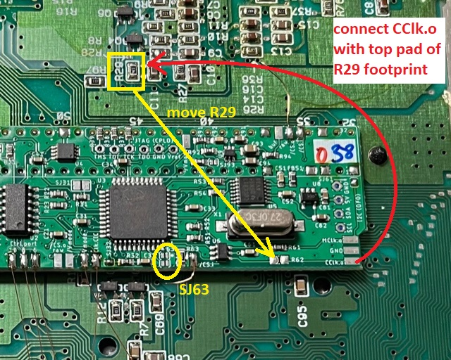

## SNSP-CPU-01 and SNSP-CPU-02

### Preparation

- remove power LED
- remove original CIC-lock (or at least lift pins 1, 2, 10 and 11)  
  
  
- if you remove the CIC-lock, you can also remove C62
  
- lift pin 24 of S-PPU1 and pin 30 of S-PPU2  
  

- disconnect Master-Clock by removing R6  
  

  (I soldered one leg of the resistor back to a footprint side to save it for possible mod-reverse)

- lift pin 8 of S-ENC   
  

### Installation of PCB

- Solder PCB in place under the cartridge slot. Be aware of the orientation (pin marking must match)
  - solder the PCB to the top of the slot pins such that there is a small gap between SNES mainboard and modding board  
    (which is easy to do if you ordered the PCB in 0.8mm thickness)  
    (or simply insulate the PCB with some tape at the bottom)
  - make sure that all connections are well flowed
  - especially pin 5 and 36 might be difficult or need more power due to large heat capacity of the underlying GND plane
- put the replacement dual LED where the original was (use a small piece of hot glue if needed) and connect the common pole to either _Ground_ or _Vcc_ (common cathod or anode, respectively)  
    
  (Picture shows a bi-color LED with common cathode and cables for red and green attached)
  - it's a good idea to connect red and green to _LED.Re_ and _LED.Gr_ once everything is finished
  - be aware of the SNES housing (if you still use the original one of this SNES mainboard), where a stability bridge is placed at the SNES mainboard front with just a cut out under the front panel connector
- connect _Rst.i_ and _Rst.o_ (either pad) to CIC-lock footprint pin 8 and 10, respectively  
  on this mainboard version, it's a good idea to connect _Rst.i_ and _Rst.o_ to the test-points as shown below
- connect _Ctrl.port.10-6_ to front panel connector pins 10 - 6
- connect _Vmode_ to lifted pins 24 and 30 of the S-PPUs
- connect _/CS.i_ to pin 100 of S-PPU2 (see picture above)  
  (since SMR20190813 you have a second _/CS.i_ pad which you can use)
- connect one of the _/CS.o (raw)_ pads to the lifted pin 8 of the S-ENC (see picture above)
- either close _SJ11_ or connect _Clk.CIC_ to CIC-lock footprint pin 7 or to the test point close to the reset button   
    
    
- close _SJ32_ and _SJ61_  
  

### CSYNC at the MultiOut

#### Pin 3 (CSYNC Pin)
In NTSC regions it is common to use cables with raw CSYNC, which is pin 3 on the MultiOut. Here is how to connect CSYNC buf to pin 3.

- remove R25 from the SNES mainboard  
- Connect _/CS.o (buf)_ to the MultiOut pin 3 
- Leave SJ93 untouched as virtually all cables using pin 3 CSYNC sync have attenuation resistors inside

#### Pin 7 (Luma Pin)
Personally, I prefer having csync at pin 7 of the MultiOut. By default, this is the luma-output. However, S-Video is hardly used in PAL region.

- remove R42 from the SNES mainboard  
- Connect _/CS.o (buf)_ to the MultiOut pin 7  
- Close _SJ93_ for proper sync attenuation

  
(picture shows pin 7 method)

### Switching Color Carrier (optional)

With the help of the modding PCB you can switch between PAL and NTSC color carrier. 

- lift pin 19 of the S-ENC
- connect either  _/Vmode_ pad to the lifted pin as shown  
  
- since SMR20190813:
  - move R29 from SNES mainboard to modding board footprint R62
  - Connect _CClk.o_ with the R29 footprint top pad
  - Close on of _SJ63_ jumper
- earlier modding boards:
  - lift pin 3 of the S-PPU2
  - short footprint R62 on the modding board
  - Connect CClk.o to C69 on the SNES mainboard (right below the modding board / CPLD U3) top pad

### Have fun!!!