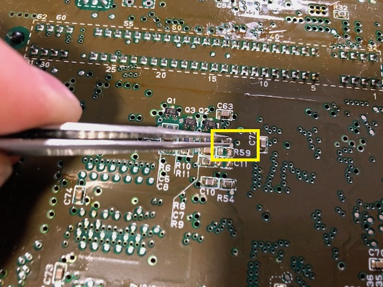
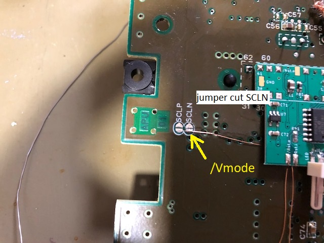
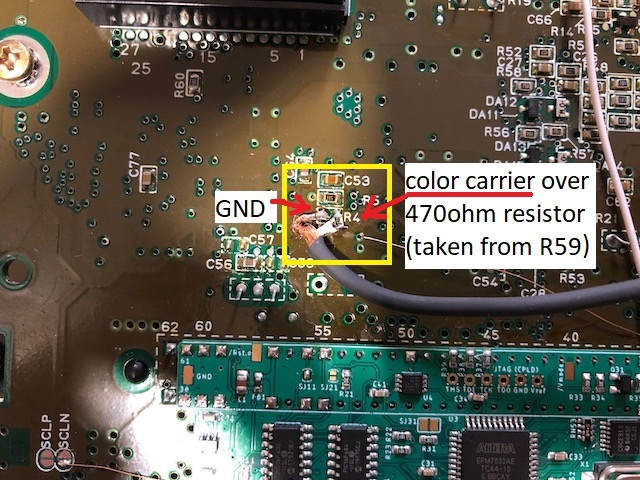
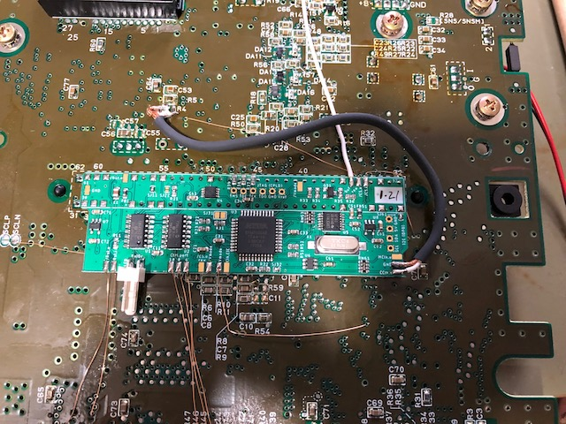

## SNS-CPU-APU-01

This SNES mainboard version is very similar to the [SNS-CPU-RGB-01](../SNS-CPU-RGB-01/), which is one of the predecessor model. Consequentially, installation is very similar. Except for the optional Color Carrier Switching part, the reader is referred to the installation manual on a [SNS-CPU-RGB-01](../SNS-CPU-RGB-01/) mainboard.

### Color Carrier

#### Remove 

Often it is suggested to remove the color carrier completely as this type of SNES mainboard. It interferes to the RGB output. To do so

- either lift pin 3 of the S-PPU2...
- or remove R59 from SNES mainboard (a 470ohm resistor)  
    
  (note that this resistor can be used at R4 in the following)

### Switching

With the help of the modding PCB you can switch between PAL and NTSC color carrier. I highly suggest you to use a shielded cable for connecting the color carrier.

- cut SCLN jumper in the middle and connect one _/Vmode_ pad as shown  
  
- remove R4 and R59, which are a 0ohm jumper and a 470ohm resistor. You need the 470ohm resistor of R59
- connect the _CClk.o_ pad over the 470ohm resistor (or any replacement resistor) to the right pad of R4 footprint as shown  
    
  **Note:** Since modding board version SMR20190813 you can place the 470ohm resistor on the modding board. The footprint it labeled _R62_.
- solder the GND shielding to _GND_ pad of the modding board
  (I also soldered the GND shielding to the left pin of R4, which is not needed at all (it's just the connection between R4 and R59))

### Overview

Once you are done, the installation may look like that.  

### Have fun!!!