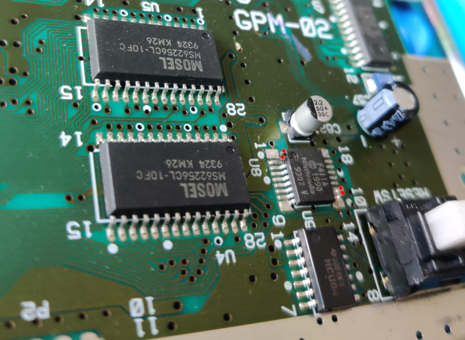
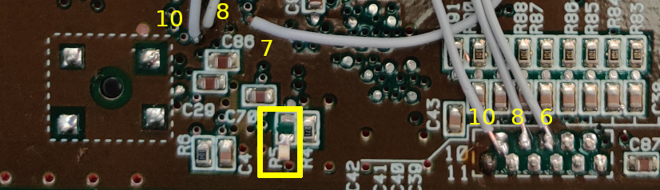
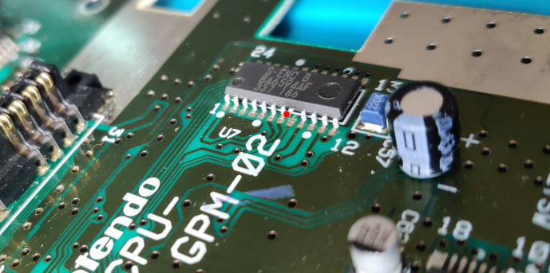
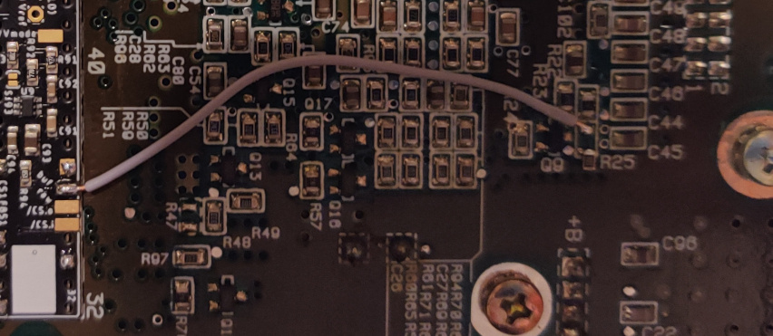
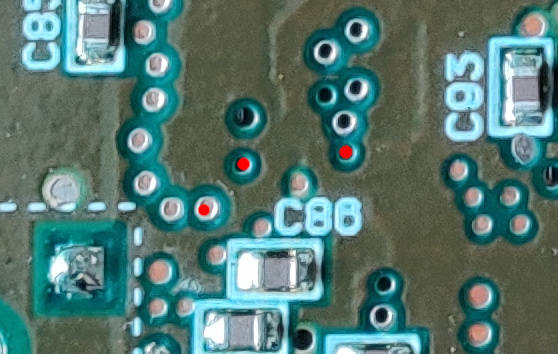
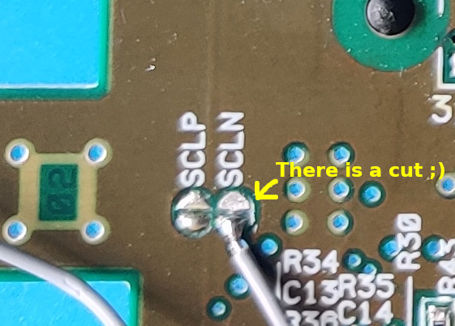
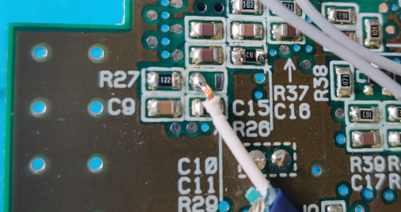
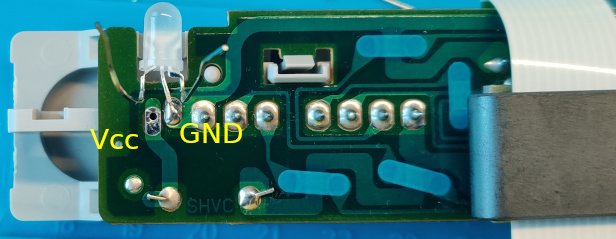
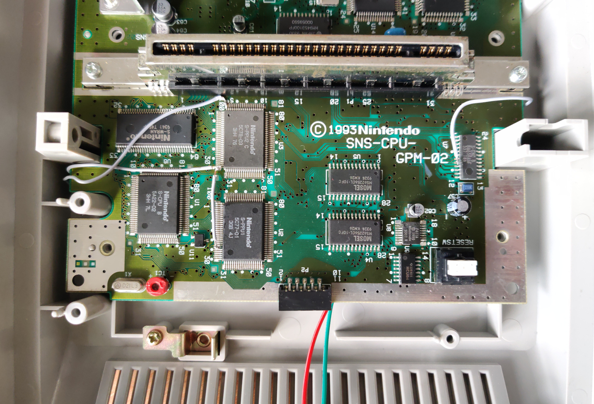

## SNS-CPU-GPM-02

The following instructions are specifically tailored towards the SNS-CPU-GPM-02
mainboard version of the Super Famicom (Japanese SNES).

While they should also apply to the SNS-CPU-GPM-01 version for the most part
(if not entirely), I do not have that version at hand to verify.

### Disassembly

- Open the case and carefully remove all moving parts of the cartridge eject
  mechanism.
- Unscrew the power slide switch. You may leave it connected, but be careful
  while handling the mainboard.
- Unscrew and remove the metal shield covering the lower half of the mainboard
  near the controller panel.
- Unscrew and remove the cartridge slot as it also holds the mainboard in place.
- Disconnect the ribbon cable to the controller panel from the mainboard.
- Unscrew and remove the mainboard from the case.

### Mainboard Preparation

- Remove the original CIC-lock (or just lift pins 1, 2, 10 and 11).  
  
- Lift pin 24 of S-PPU1 and pin 30 of S-PPU2. See the picture at the very end
  for additional reference.
- Disconnect the Master-Clock by removing R5, which is located near the reset
  switch. You can solder one leg back for easier mod-reverse. 
    
  (Disregard the wires and numbers for now, they are covered in later steps)
- Lift pin 8 of S-ENC.  
  
- Remove R25, which is located slightly below the MultiOut on the right, **if**
  you are going to use a RGB cable with sync on raw CSYNC (if you are using an
  RGB SCART cable, that is probably the case). Again, consider soldering one leg
  back for easier mod-reverse.  
    
  (Note that the wire is attached in a later step)
- If you plan on moving R29, consider doing so now. Check the section on
  [Switching](#Switching) below for more details.

### Installation of PCB

- Place the PCB under the cartridge slot. Ensure that the pin markings match and
  pins 31 and 63 remain uncovered.
- Solder the PCB to the top of the slot pins so that there is a small gap
  between the PCB and the mainboard. If your PCB is thicker than 0.8 mm or you
  just wish to be on the safe side, insulate the bottom of the PCB with tape.
- Ensure all connections are well flowed. Especially pin 5 and 36 might be
  difficult or need more power due to the large heat capacity of the underlying
  GND plane.
- Connect _Rst.i_ and _/Rst.o_ (either pad) to CIC-lock footprint pin 8 and 10,
  respectively. There are vias to access them from the other side, see below.
  Ensure they are properly attached.
- Connect _Clk.CIC_ to CIC-lock footprint pin 7. There is via to access it from
  the other side, see below. Alternatively, close _SJ11_ (not preferable).
- Connect _Ctrl.port.6_, _Ctrl.port.8_, and _Ctrl.port.10_ to the respective
  controller panel connector pins, see below.  
    
  (CIC-lock vias and controller panel connectors. Disregard R5 from earlier.)
    
  (Exact location of the CIC-lock vias)
- Connect _Vmode_ to **both** S-PPU1 lifted pin 24 and S-PPU2 lifted pin 30.
  Running one wire around the mainboard to one pin and then connecting that pin
  to the other using a shorter wire is sufficient. See the picture at the very
  end for a possible routing solution.
- Connect _/CS.i_ (either pad since SMR20190813) to S-PPU2 pin 100. Make sure to
  leave enough room for the cartridge slot when reinstalled.
- Connect either _/CS.o raw_ pad to S-ENC lifted pin 8. See the picture at the
  very end for a possible routing solution.
- Connect _/CS.o buf_ to the left footprint of R25 as shown in the photo of
  the R25 removal above.
- Close _SJ93_ **only** if you plan on using an RGB cable that does **not** have
  a 470 ohm resistor to lower the voltage built in. If you leave the jumper open
  and use a cable without one, you could damage SCART equipment. Note however
  that since the higher voltage is the default for NTSC models, all cables
  designed for those should have one. If you want to be really sure your cable
  works as intended, check the voltage on your cable's CSYNC (SCART: pin 20): if
  it is approx. 450 mV, you are fine. If it is around 1.87 V, you want a
  different cable or to close the jumper.
  You also have to close this jumper if you opt for having _CS.o buf_ replace
  luma (pin 7 of MultiOut) or composite video (pin 9 of MultiOut), but likely
  you don't (also not covered here).
- Leave _SJ31_ open unless you wish to disable the dejitter function. If you
  are using a zero-lag upscaler like the OSSC with HDMI output in your setup,
  chances are you wish to keep the dejitter function enabled to fix lost signal
  or image issues you may encounter with this mainboard version. If however you
  are using a CRT, there is not really anything to gain from it.
  You may wish to connect a slide switch to allow toggling it on and off. See
  [top-level README](../../README.md) for more details.
- Close _SJ32_ since this mainboard version is not a 1-chip model.
- Close _SJ61_ since this mainboard version is not a 1-chip model.

### Switching

With the help of the modding PCB you can switch between PAL and NTSC color
carriers. I highly suggest using a shielded cable for connecting the color
carrier as described below.

- Cut the SCLN jumper in the middle and verify with a multimeter that the two
  pads are no longer connected.
- Connect one _/Vmode_ pad to the lower/left pad of SCLN (which itself is
  connected to S-ENC pin 19).  
  
- Modding boards **with** _R62_ footprint (since SMR20190813) only:
  - Move R29 (located above the reset switch) from the mainboard to the modding
  board _R62_ footprint.
  - Connect _CClk.o_ using a shielded cable to the **left** footprint of R29
    (former location). Note that this is different from models where another
    resistor is removed instead.
- Modding boards **without** _R62_ footprint only:
  - Lift S-PPU pin 3.
  - Connect _CClk.o_ using a shielded cable with the pad below S-PPU pin 3.
- Solder the GND shielding of the cable to _GND_ of the modding board. You may
  also connect the GND shielding on the other end to the right footprint of R29
  (former location), but this is not needed.  
    
  (Picture shows the installation with R29 moved to the PCB and without GND
  shielding soldered to the other footprint)
- Modding boards **with** _SJ63_ (since SMR20200323):
  Close **exactly one** of _SJ63.1_ (marked with a dot) **or** _SJ63.2_. You may
  want to close _SJ63.2_ (no dot) to derive the color carrier signal from the
  dejittered clock. See [top-level README](../../README.md) for more details.

### Power LED

- Determine whether your replacement power LED has a common anode or cathode.
  If the middle pole must always be connected to ground for either color, it is
  the common cathode. If it is the other way round, it is the common anode.
- Note down which pole responds to which color.
- Close _SJ21_ *only* if you are using an LED with a common anode.
- Remove the original power LED. Desolder its legs to detach it and then pull it
  out. You may have to shorten and bend its legs quite a bit to get it out.
- Put the replacement power LED where the original was. Use a little bit of hot
  glue, if needed, but soldering the middle pole should give it enough hold, see
  the picture below.
- Connect the common pole to either Ground or Vcc of the power LED pads (common
  cathode or anode, respectively).  
    
  (Picture shows a bi-color LED with a common cathode)
- Connect _LED.Re_ and _LED.Gr_ to the respective poles of the LED. You may wish
  to add resistors to lower its brightness. Note that once assembled again, the
  case only leaves a gap right below the controller panel connector. It might be
  helpful to solder colored or marked wires to the pads first and put the
  mainboard back into the case before connecting the LED.
    
  (Picture shows the console partially assembled again but before connecting the
  LED or re-attaching the controller panel ribbon cable)

### Closing Remarks

- Leave _MClk.o_ unconnected since this mainboard version is not a 1-chip model.
- When experimenting with the uIGR button combinations, note that these may not
  work while you are in a game's region incompatibility screen.

**Have fun!!!**
