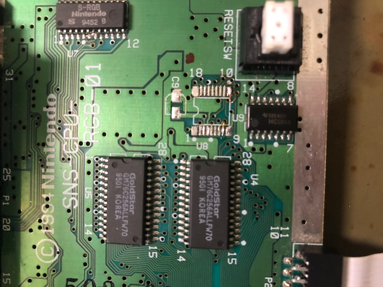
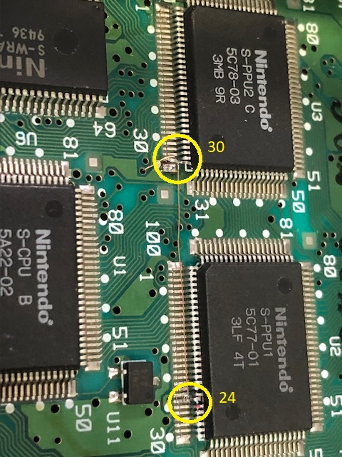
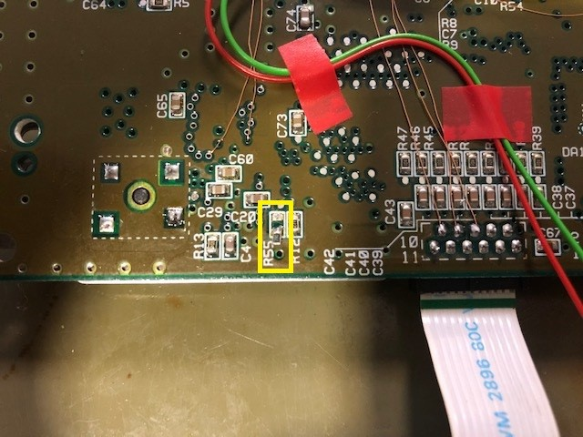
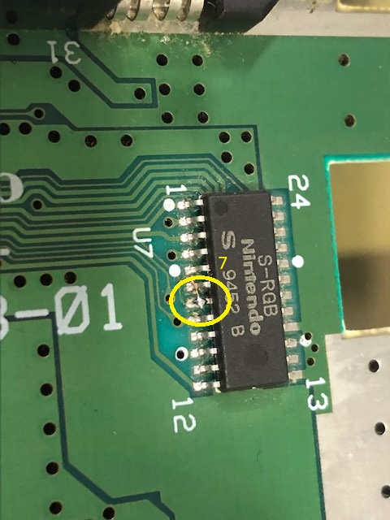
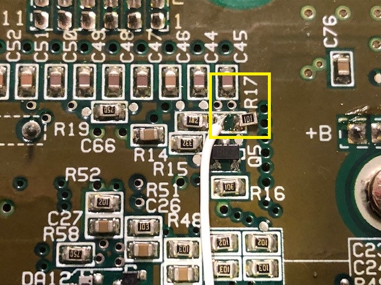
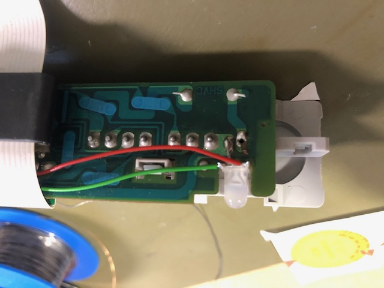
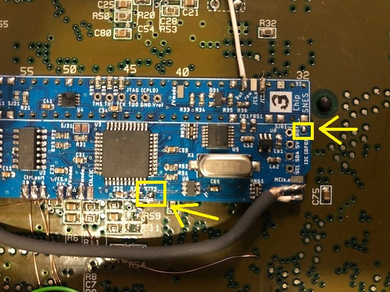
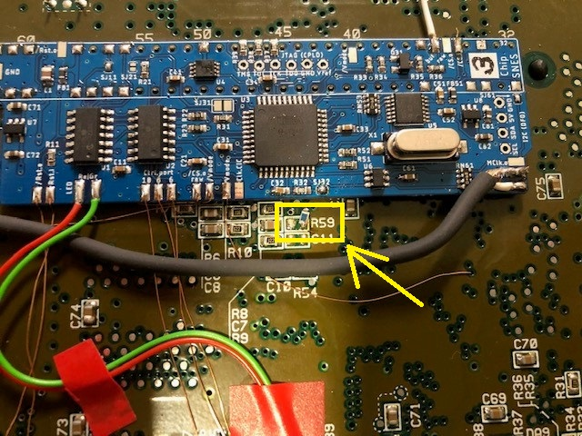
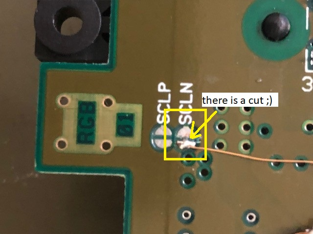
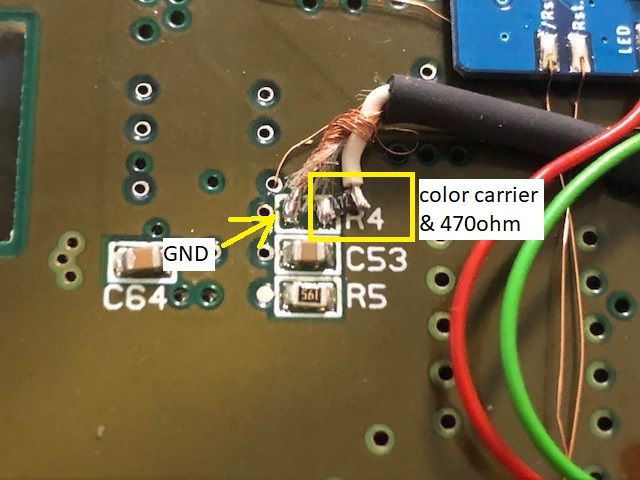

## SNS-CPU-RGB-01

### Preparation

- remove power LED
- remove original CIC-lock (or at least lift pins 1, 2, 10 and 11)  
  
  
- if you remove the CIC-lock, you can also remove C9
  
- lift pin 24 of S-PPU1 and pin 30 of S-PPU2  
  

- disconnect Master-Clock by remove R55  
  

  (I soldered one leg of the resistor back to a footprint side to save it for possible mod-reverse)

- lift pin 7 of S-RGB  
  

- remove R17  
  

### Installation of PCB

- Solder PCB in place under the cartridge slot. Be aware of the orientation (pin marking must match)
  - solder the PCB to the top of the slot pins such that there is a small between SNES mainboard and modding board  
    (which is easy to do if you ordered the PCB in 0.8mm thickness)  
    (or simply insulate the PCB with some tape at the bottom)
  - make sure that all connections are well flowed
  - especially pin 5 and 36 might be difficult or need more power due to large heat capacity of the underlying GND plane
- put the replacement dual LED where the original was (use a small piece of hot glue if needed) and connect the common pole to either _Ground_ or _Vcc_ (common cathod or anode, respectively)  
    
  (Picture shows a bi-color LED with common cathode and cables for red and green attached)
  - it's a good idea to connect red and green to _LED.Re_ and _LED.Gr_ once everything is finished
  - be aware of the SNES housing (if you still use the original one of this SNES mainboard), where a stability bridge is placed at the SNES mainboard front with just a cut out under the front panel connector
- connect _Rst.i_ and _Rst.o_ (either pad) to CIC-lock footprint pin 8 and 10, respectively
- connect _Ctrl.port.10-6_ to front panel connector pins 10 - 6
- connect _Vmode_ to lifted pins 24 and 30 of the S-PPUs
- connect _/CS.i_ to pin 100 of S-PPU2  
  (since SMR20190813 you have a second _/CS.i_ pad which you can use)
- connect one of the _/CS.o (raw)_ pads to the lifted pin 7 of the S-RGB
- connect _/CS.o (buf)_ to left footprint of R17 as shown in picture of R17 removal above
- either close _SJ11_ or connect _Clk.CIC_ to CIC-lock footprint pin 7
- close _SJ32_ and _SJ61_  
  

### Color Carrier

#### Remove 

Often it is suggested to remove the color carrier completely as this type of SNES mainboard. It interferes to the RGB output. To do so

- either lift pin 3 of the S-PPU2...
- or remove R59 from SNES mainboard (a 470ohm resistor)  
    
  (note that in the picture a 0ohm jumper is placed as I exchanged it with R4)

### Switching

With the help of the modding PCB you can switch between PAL and NTSC color carrier. I highly suggest you to use a shielded cable for connecting the color carrier.

- cut SCLN jumper in the middle and connect one _/Vmode_ pad as shown  
  
- remove R4 and R59, which are a 0ohm jumper and a 470ohm resistor. You need the 470ohm resistor of R59
- connect the _CClk.o_ pad over the 470ohm resistor (or any replacement resistor) to the right pad of R4 footprint as shown  
    
  **Note:** Since modding board version SMR20190813 you can place the 470ohm resistor on the modding board. The footprint it labeled _R62_.
- solder the GND shielding to _GND_ pad of the modding board
  (I also soldered the GND shielding to the left pin of R4, which is not needed at all (it's just the connection between R4 and R59))

### Have fun!!!