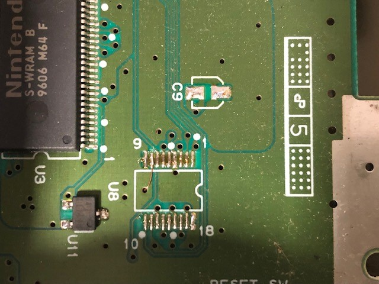
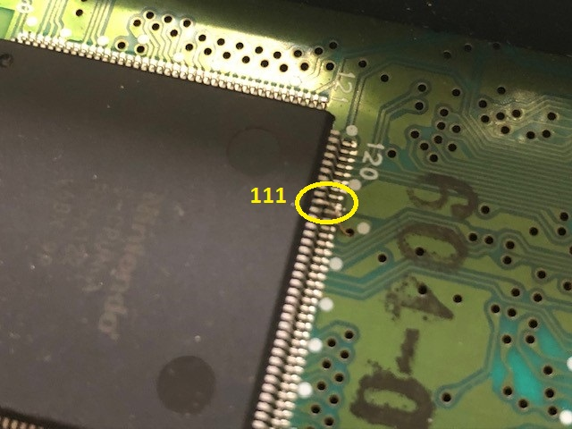
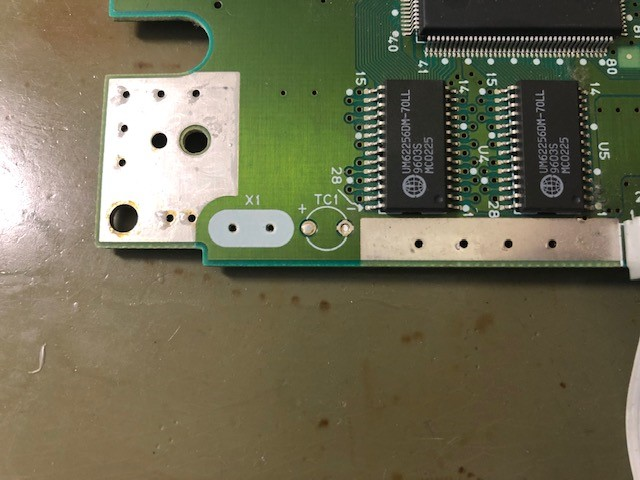
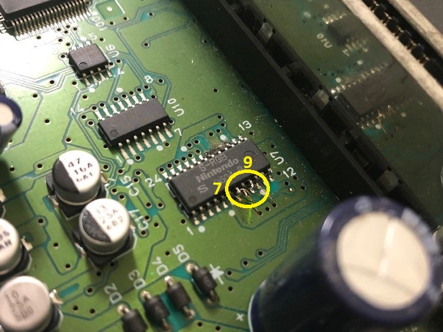
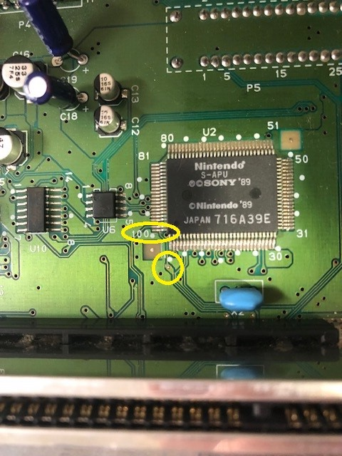
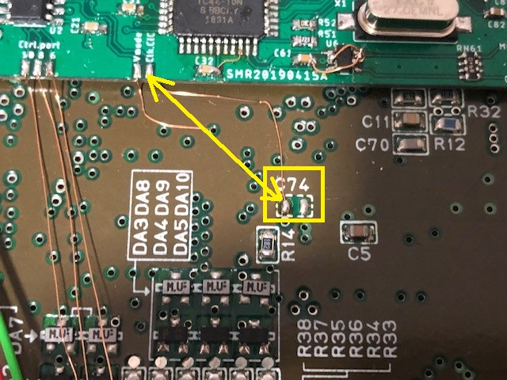
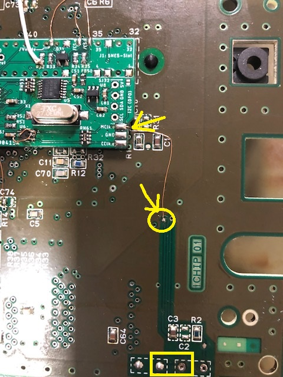
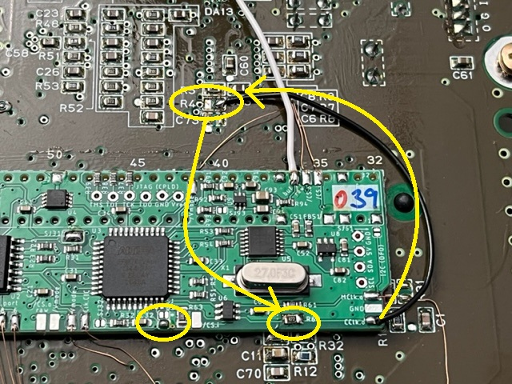
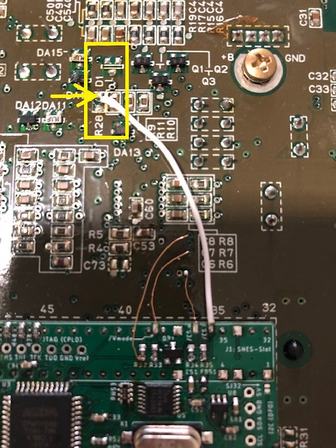

## SNSP-CPU-1CHIP-01 and SNSP-CPU-1CHIP-02

Note that this installation guide shows pictures with a prototype version of the modding PCB where some pads are placed differently and others are simply not present compared to the final version.

### Preparation

- remove power LED
- remove original CIC-lock (or at least lift pins 1, 2, 10 and 11)  
  
  - if you remove the CIC-lock, you can also remove C9

- lift pin 111 of S-CPUN  
  

- remove X1  
  

- lift pin 7 and pin 9 of S-RGB  
  

### Installation of PCB

- Solder PCB in place under the cartridge slot. Be aware of the orientation (pin marking must match)
  - solder the PCB to the top of the slot pins such that there is a small between SNES mainboard and modding board  
    (which is easy to do if you ordered the PCB in 0.8mm thickness)  
    (or simply insulate the PCB with some tape at the bottom)
  - make sure that all connections are well flowed
  - especially pin 5 and 36 might be difficult or need more power due to large heat capacity of the underlying GND plane
- put the replacement dual LED where the original was (use a small piece of hot glue if needed) and connect the common pole to either _Ground_ or _Vcc_ (common cathod or anode, respectively)  
    
  (Picture shows a bi-color LED with common cathode and cables for red and green attached)
  - it's a good idea to connect red and green to _LED.Re_ and _LED.Gr_ once everything is finished
  - be aware of the SNES housing (if you still use the original one of this SNES mainboard), where a stability bridge is placed at the SNES mainboard front with just a cut out under the front panel connector
- connect _Rst.i_  to CIC-lock footprint pin 8
- connect _Rst.o_ (either pad) to S-APU pin 100 / CIC-lock footprint pin 10. There is a via directly in front of the S-APU pin 100  
    
  
- connect _Ctrl.port.10-6_ to front panel connector pins 10 - 6
- connect _Vmode_ to lifted pin 111 of the S-CPUN
- either close _SJ11_ or connect _Clk.CIC_ to the footprint of C74 (left pad)  
  
- connect _MCLK.o_ to X1 (the side, which goes to S-CPUN pin 9)  
  
- connect _/CS.i_ to the pad of the lifted pin 7 of the S-RGB  
  (there is a via next to it - just follow the trace)   
  (from bottom the silk screen mark of C6 is next to the via; see picture below (section csync to multiout))
- connect one of the _/CS.o (raw)_ pads to the lifted pin 7 of the S-RGB
- connect _/Vmode_ to the lifted pin 9 of the S-RGB
- leave _SJ32_ and _SJ61_  open!

### Color Carrier

Color carrier is switched within the S-CPUN. There is no need to do anything in addition to the steps above.

However, if you wish to use the color carrier derived from the continuous clock, you have to perform the following steps:

- move R4 from SNES mainboard to _R62_ on the modding board
- connect pad _CClk.o_ with right pad of R4 footprint
- Close SJ63.2 jumper

### Buffered CSYNC to the MultiOut

Other than the NTSC variant of the SNES, the PAL version has 12V at the MultiOut pin 3 instead of CSYNC. However, it's not a big deal to change that.

- remove R28 and optionally D1
- Connect the upper pin of _/CS.o (buf)_ to the top footprint pad of R28 (or to the MultiOut pin 3)  
  - leave _SJ93_ open if you have an attenuation resistor in your RGB cable for csync (which is usually the case in CSYNC cables)   
  

You can also connect the buffered output to pin 7 (for use with _sync-on-luma_ cables). Just remove R19 instead of R28. Same if you want to wire the buffered output to pin 9 (for use with _sync-on-composite video_ cables). Just remove R18 instead of R28.  
In both cases, close _SJ93_ for proper signal attenuation.

### CSYNC and 'my' RGB bypass PCB

I do have an RGB bypass PCB in this repository. Just take a [look](../../../RGB Bypass/). If you use a version with CSYNC you can connect _/CS.o (raw)_ to this PCB to use it. However, you have to adopt some resistor values:

- R41: 4.7kohm
- R42:
  - 475ohm for 39ohm/75ohm compatible setup
  - 10.7kohm for TTL compatible setup

Please also take a look into the [readme](../../../RGB Bypass/README.md) and the [BOM](../../../RGB Bypass/BOM_SNES_RGB_bypass.xlsx) of that project.

### Have fun!!!